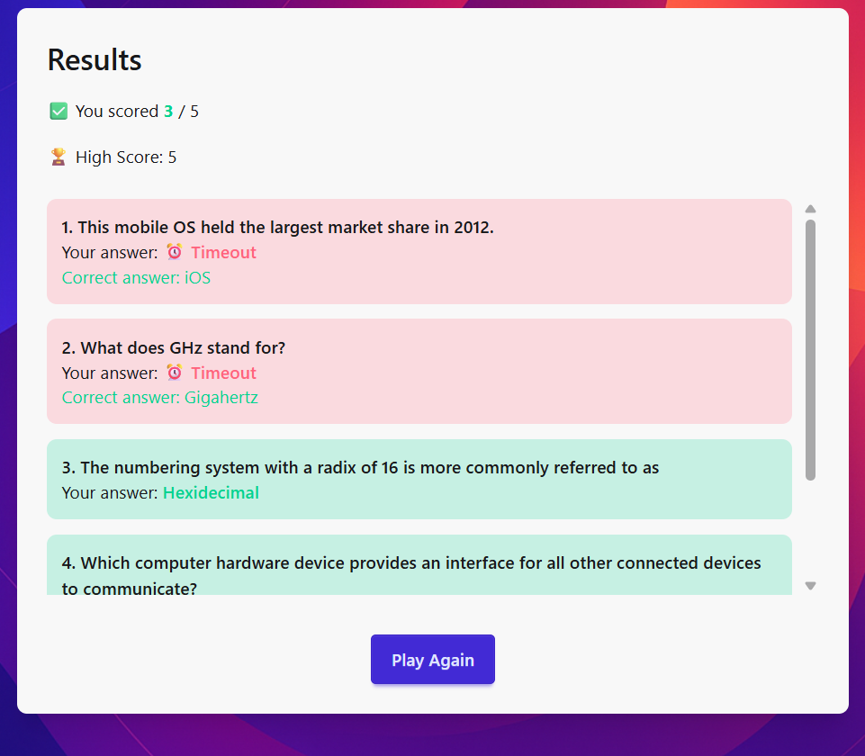

# 🎯 Quiz App

A responsive and interactive Quiz Application built with **React + TailwindCSS** that fetches multiple-choice questions from the [Open Trivia DB](https://opentdb.com/api_config.php). The app evaluates answers, tracks scores, and shows a detailed results summary.

---

## 🚀 Features
- 🎨 Clean and responsive UI (desktop & mobile)
- ❓ Multiple-choice questions (API powered)
- ⏱ Timer per question (auto move on timeout)
- 📊 Progress indicator (question count & progress bar)
- 🏆 Score tracking with **localStorage high scores**
- 🔄 Restart quiz anytime
- ⏩ Navigation: **Next, Previous, Skip**
- ⚡ Handles edge cases (no internet, empty data, refresh)

---

## 🛠 Tech Stack
- **React** (Functional components + Hooks)
- **React Router** (Quiz & Results pages)
- **TailwindCSS** (styling)
- **Axios** (API calls)
- **LocalStorage** (high scores persistence)

---

## 📷 Screenshots

### 🏠 Home Page


### ❓ Quiz Page


### 🏆 Results Page



---

## 📦 Installation & Setup

1. Clone the repo:
   
```bash
git clone https://github.com/Adityasingh2oo4/Quiz-app.git

cd quiz-app
```
   
2. Install dependencies:

```bash
npm install
```

Run the development server:
```bash
npm run dev
```

Build for production:
```bash
Copy code

npm run build
```

🌐 Deployment

Hosted on Netlify

Demo Link: https://your-quiz-app.netlify.app
